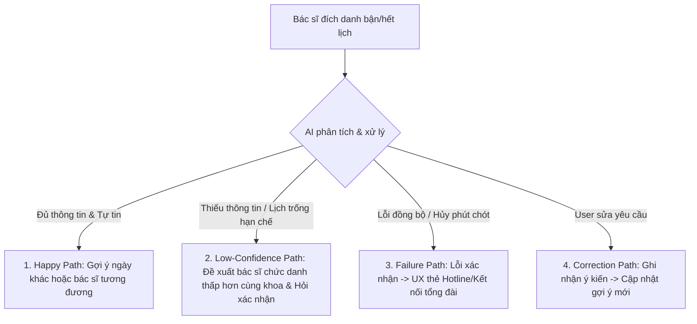

# SPEC SẢN PHẨM: TRỢ LÝ TƯ VẤN ĐỔI LỊCH KHÁM - BẠCH MAI CARE
**Nhóm:** Thanh niên áo hồng (Nhóm C2 - E403)  
**Dự án:** Trợ lý AI xử lý sự cố hết/bận lịch khám bác sĩ đích danh tại Bạch Mai Care  

---

## 1. Bằng chứng (Evidence)

Nỗi đau (pain point) của người dùng được xác định và chứng minh qua các quan sát trực tiếp và nghiên cứu thực tế sau:

### Trải nghiệm trực tiếp (Self-use evidence)
Khi nhóm chạy thử nghiệm quy trình đặt lịch trên ứng dụng Bạch Mai Care hiện tại:
- **Trải nghiệm:** Khi người dùng muốn đặt lịch khám với một bác sĩ cụ thể (ví dụ: PGS.TS. Nguyễn Văn A), hệ thống sẽ hiển thị lịch khám của bác sĩ đó. Tuy nhiên, nếu bác sĩ đó đã hết lịch khám hoặc có trạng thái bận đột xuất (đi công tác, mổ cấp cứu), hệ thống chỉ thông báo hết lịch khám tĩnh và dừng quy trình tại đó.
- **Điểm gãy:** Hệ thống không đưa ra bất kỳ giải pháp thay thế nào. Người dùng phải bấm quay lại màn hình danh sách, tự mình tìm kiếm và click vào từng bác sĩ khác cùng khoa, so sánh chức danh/chức vụ (ví dụ: tìm bác sĩ khác cũng là PGS.TS) và xem lịch của họ một cách hoàn toàn thủ công.

### Bằng chứng từ bên ngoài nhóm (External evidence)
Qua các buổi phỏng vấn nhanh với bệnh nhân tại Bệnh viện Bạch Mai và khảo sát ý kiến người dùng trên các diễn đàn y tế:
- **Ý kiến bệnh nhân lớn tuổi tỉnh xa:** *"Tôi bắt xe từ quê lên muốn khám đích danh bác sĩ Trưởng khoa tim mạch vì bệnh nặng, nhưng lên ứng dụng thì báo hết lịch khám tuần này. Tôi không biết còn bác sĩ nào chuyên môn giỏi tương đương không, hoặc tuần sau bác sĩ khám ngày nào để tôi sắp xếp xe cộ."*
- **Ý kiến người dùng ngại công nghệ:** *"Nhiều khi dùng app rất phiền phức. Gặp lúc đổi lịch hoặc hết bác sĩ tôi muốn tìm, tôi thường tắt ứng dụng và gọi thẳng lên hotline tổng đài bệnh viện nhờ nhân viên trực check và đổi hộ cho nhanh."*
- **Hệ quả:** Bệnh nhân dễ nản lòng, từ bỏ ứng dụng và chuyển sang gọi tổng đài, gây quá tải cho bộ phận CSKH trực tuyến và làm giảm tỷ lệ chuyển đổi đặt lịch thành công trên app.

---

## 2. Lát cắt để build (Build Slice)

> Cho bệnh nhân đăng ký khám bác sĩ đích danh nhưng lịch khám bị hết hoặc bị bận đột xuất, prototype sẽ dùng AI để đề xuất 2-3 phương án thay thế (gợi ý các ngày khám trống gần nhất của bác sĩ đó hoặc giới thiệu các bác sĩ tương đương cùng chuyên khoa/chức vụ/chức danh đang có lịch trống), hiển thị giao diện đổi lịch trực quan kèm nút xác nhận nhanh qua khung chat, và xử lý failure mode bằng cách hiển thị thẻ UX chuyển kết nối đến tổng đài hỗ trợ (Hotline 1900 xxxx).

---

## 3. AI Product Canvas

| Ô | Nội dung chi tiết giải pháp cho Bạch Mai Care |
|---|---|
| **Value** (Giá trị) | - **Đối tượng:** Bệnh nhân đặt lịch khám bác sĩ đích danh nhưng gặp sự cố hết/bận lịch. - **Nỗi đau:** Phải tự mò mẫm tìm kiếm ngày khác hoặc bác sĩ thay thế tương đương cùng khoa. - **Giải pháp AI:** Tự động đề xuất lịch trống gần nhất hoặc bác sĩ có trình độ tương đương (chức danh PGS, TS) thông qua giao diện chat trực quan, giúp người dùng đưa ra quyết định nhanh chóng mà không cần thoát luồng. |
| **Trust** (Niềm tin) | - **Nhận biết lỗi:** Người dùng dễ dàng so sánh đề xuất của AI (ngày khám, tên bác sĩ thay thế, chuyên khoa) trực tiếp trên giao diện chat. - **Khắc phục lỗi:** Cung cấp nút hoàn tác (Undo), cho phép người dùng từ chối đề xuất và yêu cầu phương án khác ("Tìm bác sĩ khác", "Đổi ngày khác"). Nếu hệ thống lỗi nặng, cung cấp thẻ UX nổi bật để người dùng nhấn nút kết nối trực tiếp đến tổng đài viên cứu hộ. |
| **Feasibility** (Tính khả thi) | - **Mô hình:** `Gemini 2.5 Flash` (API của Google). - **Thông số:** Độ trễ mục tiêu dưới 2 giây/phản hồi, chi phí API cực kỳ thấp (khoảng $0.0001 mỗi cuộc hội thoại). - **Dữ liệu đầu vào:** File mock database JSON `doctors.json` chứa thông tin lịch khám thời gian thực. - **Rủi ro lớn nhất:** AI gợi ý sai bác sĩ ngoài khoa hoặc đổi lịch không tồn tại. - **Ngưỡng dừng:** Độ trễ trung bình > 5 giây hoặc tỷ lệ dời lịch thành công dưới 85% trong quá trình thử nghiệm. |
| **Tín hiệu học** (Learning Signals) | - **Nguồn dữ liệu:** Khi người dùng đồng ý đổi lịch hoặc từ chối để chỉnh sửa lại lựa chọn, chatbot sẽ ghi nhận sự kiện này. - **Lưu trữ:** Ghi log cục bộ vào file `feedback_logs.json` dưới dạng các cặp dữ liệu `[Lịch_AI_gợi_ý, Lịch_User_chọn_thực_tế]`. - **Ứng dụng:** Dữ liệu log này được dùng để đánh giá độ chính xác của đề xuất và định kỳ cập nhật prompts/tập test hàng tuần nhằm tối ưu hóa thuật toán gợi ý của chatbot. |

---

## 4. Tăng năng lực hay tự động hóa (Augment/Automate)

Chọn phương án: **Tăng năng lực (Augmentation)**

### Lý do lựa chọn
Lĩnh vực y tế và chăm sóc sức khỏe có mức độ rủi ro rất cao và nhạy cảm. Quyết định khám bệnh khi nào và khám với bác sĩ nào là quyền chủ động cá nhân tối cao của bệnh nhân và người nhà. AI chỉ đóng vai trò cung cấp thông tin, phân tích dữ liệu lịch khám phức tạp và đưa ra các đề xuất tối ưu nhất để người dùng lựa chọn, chứ không được tự ý đổi lịch khi chưa được phê duyệt.

### Vai trò của con người
- **User (Bệnh nhân) - Vai trò Decider (Người quyết định):** Người dùng xem các phương án gợi ý và trực tiếp nhấn chọn phương án phù hợp nhất với bản thân. Không có bất kỳ giao dịch đổi lịch nào được thực hiện tự động mà không có sự xác nhận của người dùng.
- **Tổng đài viên - Vai trò Rescuer (Người giải cứu):** Khi xảy ra lỗi hệ thống (ví dụ: sự cố đồng bộ lịch khám thời gian thực) hoặc chatbot không thể tìm ra phương án phù hợp, tổng đài viên sẽ tiếp nhận thông tin từ thẻ UX cứu hộ để gọi điện thoại hỗ trợ trực tiếp cho bệnh nhân.

---

## 5. Bốn đường đi của trải nghiệm (4 Paths)

Chatbot xử lý 4 tình huống trải nghiệm của người dùng như sau:

### 1. Đường thuận (Happy Path)
- **Kịch bản:** PGS.TS. Nguyễn Văn A bận mổ đột xuất vào ngày mai. AI phân tích cơ sở dữ liệu và nhận thấy:
  1. Bác sĩ A có lịch trống vào thứ Năm tuần này.
  2. PGS.TS. Trần Thị B (cùng khoa Tim mạch, cùng chức danh PGS) đang có lịch trống vào ngày mai.
- **Trải nghiệm:** Chatbot chủ động gửi tin nhắn thông báo sự cố bận của bác sĩ A, hiển thị rõ 2 phương án thay thế nêu trên dưới dạng các thẻ UI có nút chọn nhanh.
- **Kết quả:** User bấm vào phương án 2 (Đổi sang bác sĩ B). Chatbot gọi API cập nhật database thành công và hiển thị thông báo đổi lịch mới thành công kèm mã QR code đặt khám.

### 2. Khi AI không chắc (Low-Confidence Path)
- **Kịch bản:** Bác sĩ A hết lịch trong vòng 2 tuần tới, và không có bác sĩ nào có chức danh PGS khác cùng chuyên khoa còn lịch trống.
- **Trải nghiệm:** AI không tự tiện đề cử một bác sĩ không tương đương mà hỏi lại người dùng: *"Bác sĩ A hiện không có lịch trống trong 2 tuần tới và các bác sĩ cùng chức danh PGS cũng đã đầy lịch. Bạn có muốn tham khảo TS.BS. Phạm Văn C (chức danh Tiến sĩ, cùng khoa Tim mạch) đang có lịch vào ngày mai không?"* kèm nút "Xem thông tin bác sĩ C" và "Tìm chuyên khoa khác".
- **Kết quả:** Giúp người dùng chủ động điều chỉnh kỳ vọng về chức danh để được khám sớm nhất.

### 3. Khi AI sai hoặc Hệ thống lỗi (Failure Path)
- **Kịch bản:** AI gợi ý bác sĩ thay thế B, người dùng đồng ý đổi lịch và bấm xác nhận. Tuy nhiên, tại thời điểm lưu dữ liệu, lịch khám của bác sĩ B vừa mới bị khóa (do bác sĩ đột xuất có lịch hội chẩn khẩn cấp vừa cập nhật lên hệ thống).
- **Trải nghiệm:** Hệ thống trả về lỗi cập nhật database. Chatbot lập tức kích hoạt cơ chế fallback: *"Thành thật xin lỗi bạn, lịch khám của bác sĩ B vừa có sự thay đổi đột xuất. Hệ thống đã lưu thông tin đăng ký của bạn."* Đồng thời, chatbot hiển thị một **Thẻ cứu hộ UX trực quan** chứa nút nhấn **"Kết nối Tổng đài viên"** và số điện thoại hotline **1900 xxxx**.
- **Kết quả:** Chuyển giao thông tin người dùng sang tổng đài viên để liên hệ điện thoại hỗ trợ trực tiếp, đảm bảo không bỏ rơi khách hàng.

### 4. Khi người dùng sửa (Correction Path)
- **Kịch bản:** Chatbot đề xuất đổi sang bác sĩ B, nhưng người dùng nhắn vào khung chat: *"Tôi không muốn khám bác sĩ B, hãy đổi sang bác sĩ C"* hoặc *"Tôi muốn đổi sang một ngày khác vào tuần sau"*.
- **Trải nghiệm:** AI phân tích câu lệnh, không thực hiện lưu lịch bác sĩ B, đồng thời gọi lại API tra cứu để cập nhật danh sách gợi ý mới theo đúng yêu cầu: hiển thị lịch khám của bác sĩ C hoặc các lịch trống tuần sau.
- **Kết quả:** Giữ nguyên trạng thái lịch khám cũ cho đến khi người dùng nhấn nút xác nhận cuối cùng trên gợi ý mới.

---

## 6. Những kiểu lỗi đáng lo nhất (Critical Failure Modes)

### Lỗi 1: Sự cố đồng bộ lịch khám thời gian thực (Real-time Out-of-Sync)
- **Bối cảnh xuất hiện:** Xảy ra khi dữ liệu lịch khám của bác sĩ thay đổi liên tục nhưng không được cập nhật kịp thời vào phiên hội thoại của chatbot.
- **Hậu quả:** Người dùng bấm xác nhận đổi lịch thành công trên giao diện chat, nhưng khi đến bệnh viện thì lịch thực tế đã bị hủy hoặc bị trùng. Bệnh nhân chịu thiệt hại nặng về thời gian, chi phí di chuyển (đặc biệt là bệnh nhân ở tỉnh xa), gây ảnh hưởng nghiêm trọng đến uy tín của bệnh viện.
- **Phương án xử lý:** Prototype thực hiện cơ chế **Kiểm tra thời gian thực kép (Double API Verification)**: một lần khi chuẩn bị hiển thị gợi ý, và một lần nữa ngay tại thời điểm người dùng bấm nút "Xác nhận". Nếu kiểm tra lần hai thất bại, kích hoạt ngay Failure Path chuyển tổng đài.

### Lỗi 2: Trôi ngữ cảnh hội thoại (Context Drift)
- **Bối cảnh xuất hiện:** Người dùng nhập các câu hỏi mơ hồ, câu hỏi y tế chung chung nằm ngoài phạm vi đổi lịch, hoặc gõ văn bản quá dài khiến chatbot bị mất dấu vết (forget) ngữ cảnh đổi lịch hiện tại.
- **Hậu quả:** AI đưa ra các câu trả lời sai lệch, lặp lại câu hỏi cũ hoặc tư vấn sai chuyên môn y tế.
- **Phương án xử lý:** Thiết lập System Instruction nghiêm ngặt cho LLM: chỉ tập trung vào nghiệp vụ giải quyết sự cố đặt lịch khám, từ chối trả lời các câu hỏi chẩn đoán bệnh sâu, và luôn giữ biến trạng thái lịch hiện tại (`current_appointment_state`) trong bộ nhớ context. Nếu người dùng đi lệch quá 2 câu thoại, chatbot sẽ hiển thị nút định hướng: *"Bạn có muốn tiếp tục xử lý việc đổi lịch khám không?"*.

---

## 7. Kế hoạch kiểm thử và bằng chứng demo (Test Cases)

Để chạy thử nghiệm và kiểm chứng tính năng của chatbot trước hội đồng, nhóm chuẩn bị sẵn 2 kịch bản dữ liệu đầu vào sau:

### Kịch bản 1: Kiểm thử Đường thuận (Happy Case)
- **Input của User:** *"Tôi có lịch khám với PGS.TS. Nguyễn Văn A vào ngày mai nhưng hệ thống báo bác sĩ bận đột xuất. Tôi phải làm sao?"*
- **Kỳ vọng đầu ra:** Chatbot hiển thị thông báo xin lỗi lịch bận của bác sĩ A, tự động truy vấn dữ liệu và hiển thị 2 thẻ chọn:
  1. Đổi sang lịch bác sĩ A vào thứ Năm (06/06/2026).
  2. Đổi sang PGS.TS. Trần Thị B (cùng khoa Tim mạch) vào ngày mai (05/06/2026).
- **Hành động tiếp theo:** Người dùng bấm nút chọn PGS.TS. Trần Thị B -> Chatbot phản hồi xác nhận thành công và hiển thị thẻ thông tin lịch khám mới.

### Kịch bản 2: Kiểm thử Kịch bản Gây nhiễu và Lỗi (Noisy/Failure Case)
- **Input của User:** *"Bác sĩ A bận rồi à? Thế đổi cho tôi sang bác sĩ nào giỏi tương đương vào ngày mai nhé. À mà bệnh tim thì ăn gì tốt nhỉ?"* (Input chứa câu hỏi ngoài lề gây nhiễu ngữ cảnh).
- **Kỳ vọng đầu ra:** 
  1. Chatbot nhận diện câu hỏi ăn uống là ngoài phạm vi hỗ trợ đặt lịch, trả lời lịch sự từ chối tư vấn chế độ ăn.
  2. Chatbot vẫn tập trung giải quyết task chính: hiển thị đề xuất đổi sang PGS.TS. Trần Thị B vào ngày mai.
- **Hành động kiểm thử lỗi:** Người dùng bấm nút chọn PGS.TS. Trần Thị B, nhưng hệ thống mô phỏng lỗi API đồng bộ database bị khóa -> Chatbot hiển thị thông báo lỗi và hiển thị **thẻ UX Kết nối Tổng đài viên (Hotline 1900 xxxx)**.

---

## 8. Phân công nhiệm vụ (Role Assignment)

Để đảm bảo hiệu quả làm việc nhóm trong thời gian ngắn của buổi Hackathon Day 06, công việc được phân chia chi tiết như sau:

| Thành viên | Vai trò | Công việc cụ thể | Bằng chứng kiểm tra trong Repo |
|---|---|---|---|
| **Trần Minh Hoàng** (2A202600700) | **Spec/AI Backend Developer** | - Hoàn thiện tài liệu SPEC sản phẩm (`spec/spec.md`). - Viết System Prompt và thiết lập luồng xử lý của API Gemini 2.5 Flash. - Viết code logic xử lý cuộc thoại và gọi dữ liệu. | - File `spec/spec.md` - Code logic backend gọi API LLM trong thư mục `codebase/` |
| **Nguyễn Thế Giáp** (2A202600912) | **Research & Mock Data** | - Hoàn thiện hồ sơ dữ liệu tại `docs/evidence-pack.md`. - Thiết lập cơ sở dữ liệu giả lập danh sách bác sĩ và lịch khám bệnh viện (`doctors.json`). | - File `docs/evidence-pack.md` - File dữ liệu `codebase/doctors.json` |
| **Nguyễn Quang Minh** (2A202600994) | **Frontend Developer** | - Phát triển giao diện người dùng (UI) khung chat trực quan của Bạch Mai Care. - Thiết kế các thẻ hiển thị phương án gợi ý trực quan và nút chuyển đổi tổng đài viên. | - Mã nguồn giao diện chat (HTML/CSS/JS) trong thư mục `codebase/` |
| **Nguyễn Hữu Thái Minh** (2A202600619) | **QA Tester & Demo Coordinator** | - Viết kịch bản hội thoại và chạy thử nghiệm các Test Cases. - Thực hiện kiểm thử chatbot, ghi log lỗi. - Chuẩn bị slide thuyết trình và quay video vận hành backup. | - File kịch bản `codebase/backend/test/manual_test_scripts.md` - Bản ghi log test thử nghiệm và video demo đính kèm |
